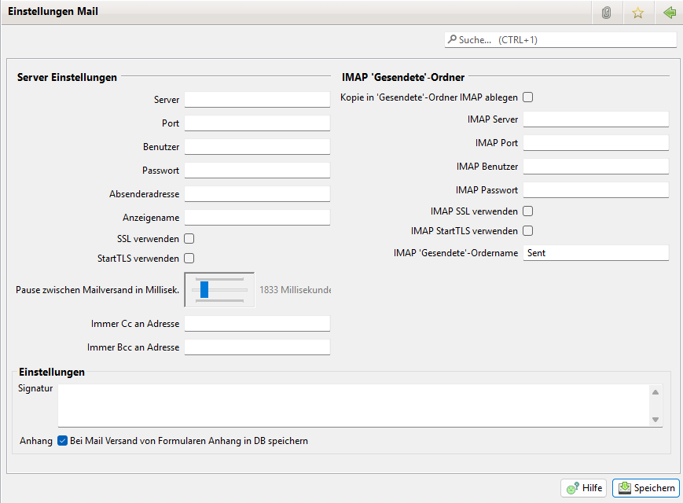

# Mail

In diesem Dialog sind die Daten für den Mailzugang einzurichten.

Über die Option "Bei Mail Versand von Formularen Anhang in DB speichern" lässt sich einstellen, ob bei versendeten Formularen wie z.B. Rechnung, Mahnung etc. der Mailanhang zusammen mit der Mail in der Datenbank gespeichert werden sollen. Damit lässt sich später beim betrachten der Mail auch der Anhang sehen.

Alternativ zur EMail-Adresse kann auch der Name zur Absenderadresse hinzugefügt werden: "Mein Name \<vorstand@verein.de>" Wichtig ist dabei das Format: (Name) (Spitze Klammer auf) (Email) (Spitze Klammer zu)

Hinweis: Die Passwörter werden aber JVerein 2.6.1 verschlüsselt in einer Jameica-Wallet-Datei abgelegt (im Jameica Datenordner, Unterordner "cfg"), und sind mit dem Jameica-Masterpasswort gesichert, das beim Starten von JVerein eingegeben wird.

Um versendete EMails auch im EMail-Postfach (und nicht nur in JVerein) abzulegen, gibt es zwei Möglichkeiten:

1. Eine Kopie (Cc) oder Blindkopie (Bcc) der Mail verschicken. Dazu das Feld "Immer Cc an Adresse" oder "Immer Bcc an Adresse" mit einer Mailadresse ausfüllen.
2. Die Mail in den "Gesendete"-Ordner eines ggf. vorhandenen IMAP-Kontos ablegen. Dazu den Bereich "IMAP 'Gesendete'-Ordner mit den IMAP-Zugangsdaten ausfüllen und "Kopie in 'Gesendete'-Ordner IMAP ablegen" anklicken. Der technische Name des "Gesendete"-Ordners kann variieren, ist aber meist "Sent".

Beide Möglichkeiten können auch kombiniert werden.
