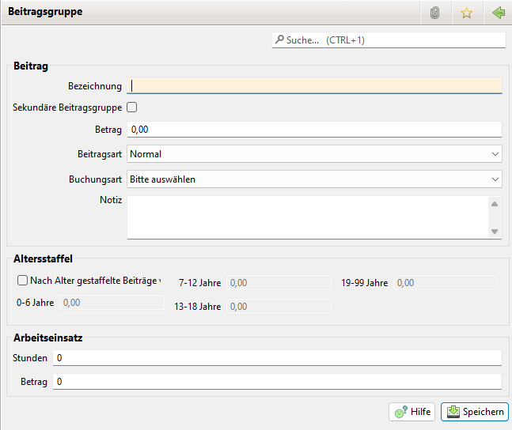

# Beitragsgruppen

Es muss mindestens eine Beitragsgruppe erfasst werden. 

## Liste der Beitragsgruppen

Mit Neu kann eine neue Beitragsgruppe eingerichtet werden.

Durch einen Doppelklick wird die Bearbeitung einer Beitragsgruppe eingeleitet.

Das Kontextmenü bietet folgende Optionen:
* Bearbeiten: Der ausgewählte Eintrag wird zum Bearbeiten geöffnet
* Löschen: Damit kann eine Beitragsgruppe, die keinem Mitglied zugeordnet ist, gelöscht werden. Bei zugeordneten Beitragsgruppen erscheint eine Fehlermeldung

## Beitragsgruppe

### Bezeichnung

Bezeichnung der Beitragsgruppe.

### Sekundäre Beitragsgruppen

Sollen für Mitglieder die Beiträge aus mehr als einer Beitragsgruppe abgerechnet werden, können sekundäre Beitragsgruppen eingerichtet werden. Dazu muss unter Administration-&gt;Einstellungen-&gt;Anzeige das Häkchen "Sekundäre Beitragsgruppen anzeigen" gesetzt werden. Anschließend ist es möglich, Beitragsgruppen als sekundäre Beitragsgruppen zu kennzeichnen.

Die so gekennzeichneten Beitragsgruppen können den Mitgliedern als sekundäre Beitragsgruppe zugewiesen werden.

### Betrag

Mitgliedsbetrag

### Beitragsart

Jeder Beitragsgruppe ist eine der folgenden Arten zuzuordnen:

1. Normal
2. Familienangehöriger

#### Beitragsart Normal

Dies ist die Standard-Beitragsart, die für alle Mitglieder gewählt sein sollte, die nicht zu einer \(als solchen gemeldeten\) Familie gehören.

#### Beitragsart Familienangehöriger

Es gibt Anwendungsfälle in denen in einer Familie die Beiträge für Partner oder Kinder reduziert oder sogar erlassen sind. Dies gilt aber nur solange auch ein voll zahlendes Familienmitglied existiert.

Um diese Beziehung zu modellieren wurde das Familienkonzept eingeführt. In einer Familie muss es ein voll zahlendes Mitglied geben. Der Familie können mehrere Familienmitglieder zugeordnet werden. Die Zuordnung wird in den Mitgliedsdaten konfiguriert.

Bis zur Version 2.8.22 gab es je eine Beitragsgruppe für das voll zahlende Familienmitglied und eine Beitragsgruppe für die Familienmitglieder. Für Familienmitglieder konnte kein Beitrag konfiguriert werden. Sie wurden als beitragsfrei angenommen.

Mit der Version 2.8.23 wurde das Konzept verallgemeinert.

Voll zahlende Familienmitglieder brauchen keine eigene Beitragsgruppe mehr. Man kann jedem Mitglied mit einer normalen Beitragsgruppe ein Familienmitglied zuweisen.

Für Familienmitglieder sind Beitragsarten der Art Familienangehöriger zu definieren. Für diese können jetzt auch Beiträge konfiguriert werden. Also etwa ein niedrigerer Beitrag oder auch kein Beitrag. Die eigene Beitragsgruppe dient dazu, um überprüfen zu können, dass für ein Mitglied mit Familienbeitrag auch ein voll zahlendes Mitglied existiert.

### Buchungsart

Buchungsart für den Beitrag.

### Notiz

Zu einer Beitragsgruppe kann eine interne Notiz erfasst werden.

### Altersstaffel

Bei Benutzung der Altersstaffel können Altersabhängige Beiträge konfiguriert werden.

Die angezeigten Altersbereiche können unter Administration-&gt;Einstellungen-&gt;Abrechnung konfiguriert werden. 

### Arbeitseinsatz

Hier lässt sich ein zu leistender Arbeitseinsatz konfiguriert werden.

Die Anzeige von Arbeitseinsatz muss unter Administration-&gt;Einstellungen-&gt;Anzeige konfiguriert werden. 

