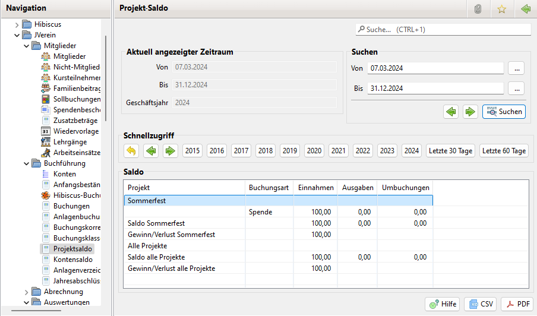

# Projektsaldo

## Einstellungen

Unter Administration->Buchführung->Projekte werden die Projekte angelegt bzw. bearbeitet.

## Projekt-Saldo

In Anlehnung an die Funktion Buchungsklassensaldo liefert die Funktion Projekt-Saldo, die über Buchführung\|Projekte aufgerufen wird, die Einnahmen und Ausgaben aller Projekte gruppiert nach Buchungsarten. Auch die Salden aller Einnahmen und Ausgaben je Projekt sowie der jeweilige Projektgewinn werden ermittelt.

Das jeweilige Geschäftsjahr lässt sich über die Schnellzugriff Buttons auswählen. Mit den Navigations Pfeilen lässt sich die Zeitachse um jeweils 5 Jahre verschieben. Mit dem Zurück Button kommt man zum aktuellen Geschäftsjahr zurück.

Der aktuell ausgewählte Zeitraum wird angezeigt.

Über die Suchen Funktion lassen sich beliebige Zeiträume auswählen.

Mit den den Navigations Pfeilen lässt sich der ausgewählte Bereich nach vorne oder hinten verschieben.

Beginnt das Von Datum an einem Monatsanfang und endet das Bis Datum an einem letzten Tag eines Monats, wird Monatsweise geblättert. Andernfalls mit der Anzahl der Tage des Zeitbereichs.

Um sich wiederholende Projekte z.B. jahresweise vergleichen zu können, kann entweder für jedes Jahr ein neues Projekt mit Jahreszahl \(z.B. "St. Martin 2013", "St. Martin 2014" usw.\) verwendet werden. Dann erhält man bei einem mehrjährigen Datumsbereich die einzelnen Projekte in einer Liste \(wie im Beispiel des obigen Screenshots\).

Alternativ kann man aber auch stets dasselbe Projekt verwenden \(z.B. "St. Martin"\) und dann für einen Mehrjahresvergleich die Auswertung mit unterschiedlichen Datumsbereichen \(je Jahr\) mehrmals abrufen.

Die Tabelle kann als PDF-Datei oder CSV-Datei ausgegeben werden.

### Buchungen

Die Liste aller Buchungen \(Buchführung\|Buchungen\) kann auf ein Projekt, ggf. auch mit Datumseingrenzung, gefiltert werden. So erhält man die Liste aller Buchungen zu einen Projekt, die auch als PDF- oder CSV-Datei ausgegeben werden kann.

