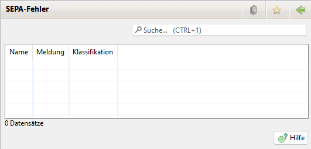

# Abrechnung

## Voraussetzungen

Unter Administration->Einstellungen->Allgemein muss das Konto eingetragen sein, auf das die Lastschriften gutgeschrieben werden sollen. Bei Verwendung von Lastschriften muss die Gläubiger-ID eingetragen werden. Gläubiger-ID können unter [https://extranet.bundesbank.de/scp/](https://extranet.bundesbank.de/scp/) oder [http://www.oenb.at/idakilz/cid?lang=de](http://www.oenb.at/idakilz/cid?lang=de) beantragt werden. Zu Testzwecken kann DE98ZZZ09999999999 eingesetzt werden.

Unter Abministration->Einstellungen->Abrechnung "Verechnungskonto für Lastschriften" muss das Konto augewählt werden auf das die Gegenbuchunge von Lastschriften gebucht werden.

## SEPA-Fehler

Vor einer Abrechnung sollte die SEPA-Fehlerliste überprüft werden. In der Liste werden Mitglieder mit fehlenden oder ungültigen Bankverbindungen sowie Mandate angezeigt, die seit mehr als 36 Monaten nicht mehr genutzt wurden.

## Abrechnung

Die Abrechnung wird mit dem "Neu" Button aus dem [Abrechnungsläufe View](abrechnungslauf.md) initiiert. Es können

* Mitgliedsbeiträge je nach Beitragsmodell
* Beiträge für im laufenden Jahr eingetretene Mitglieder
* Beiträge für abgemeldete Mitglieder
* Zusatzbeträge
* Kursteilnehmer

verarbeitet werden.

Sofern als Modus nicht 'Keine Beitragsabrechnung' ausgewählt wurde, werden für alle Mitglieder, die nicht ausgetreten sind oder deren Austrittsdatum nach dem Stichtag liegt, die Beiträge gemäß eingetragener Beitragsgruppe und Zahlungsrhythmus eingezogen.

Für Mitglieder, die im Laufe des Jahres eingetreten sind, können ebenfalls die Beiträge eingezogen werden. Dazu wird das Eintrittsdatum eingetragen, ab dem die Beiträge für nachträglich eingetretene Mitglieder abgebucht werden sollen.

Um nur Mitglieder abzurechnen, die sich schon abgemeldet haben, wird das maximale Austrittsdatum eingetragen. Dann werden Beiträge nur für die Mitglieder abgebucht, die bis dahin ausgetreten sind.

Die Abrechnungsdaten werden in das Mitgliedskonto geschrieben.

### Parameter

#### Modus 

**Keine Beitragsabrechnung**

Es werden keine Beiträge abgerechnet. Dieser Parameter ist zu setzen, wenn ausschließlich Kursteilnehmer oder Zusatzbeträge abgerechnet werden sollen.

**Alle**

Es werden alle Mitglieder entsprechend des eingestellten [Beitragsmodelle](../../../allgemein/beitragsmodelle.md) abgerechnet. Es werden alle Mitglieder abgerechnet, die zum Stichtag bereits eingetreten sind und die zum Stichtag noch nicht ausgetreten sind. Dabei werden [Beitragsgruppen](../administration/mitglieder/beitragsgruppen.md) und Zahlungsrhythmus sowie ggf. individuelle Beiträge berücksichtigt.

**Eingetretene Mitglieder**

Es werden die neu eingetretenen Mitglieder abgerechnet. JVerein verwendet das Eintrittsdatum oder das Eingabedatum zur Selektion der eingetretenen Mitglieder.

Tipp zum Workflow: Zuerst noch neue Mitglieder anlegen. Danach die Abrechnung machen und dabei als Datum für Von Eintrittsdatum/Eingabedatum den Tag nach der letzten Abrechnung für eingetretene Mitglieder (ersatzweise den Tag nach der letzten Abrechnung für Alle) verwenden. Nach der Abrechnung am selben Tag keine neuen Mitglieder mehr erfassen, die würden bei diesem Workflow sonst nicht mehr abgerechnet.

Es reicht aus, eines der beiden Attribute zu setzen.

Hinweis: Das Eintrittsdatum wird bei der Migration von Mitgliedern nicht gesetzt.

**Abgemeldete Mitglieder**

Es werden nur Mitglieder abgerechnet, die sich schon abgemeldet haben.

#### Fälligkeit

Die Fälligkeit von Lastschriften muss mindestens einen Bankarbeitstag nach Einreichung liegen. JVerein macht ausgehend vom aktuellen Datum einen Vorschlag mit dem frühestmöglichen Datum. Das Datum kann überschrieben werden. Es wird 1:1 in die SEPA-Datei eingetragen. Weitere Auswirkung auf die Abrechnung hat das Datum nicht. Die Sollbuchungen werden ebenfalls mit diesem Datum erstellt.

Falls es bei der Abrechnung keine Lastschriften gibt, kann das Datum auch in der Vergangenheit liegen.

#### Stichtag

Stichtag für die Berechnung der Mitgliedschaft und der Fälligkeit von Zusatzbeträgen.

#### Zahlungsgrund für Beiträge

Hier kann ein Text erfasst werden (z.B. ''Jahresbeitrag 2015''). Dieser Text wird bei Lastschriften im Verwendungszweck (hier zwischen der Bezeichnung der [Beitragsgruppen](../administration/mitglieder/beitragsgruppen.md) und dem Betrag) ausgegeben.

Der Text sollte aussagekräftig und knapp gewählt werden da er sonst evtl. abgeschnitten wird (Länge des Verwendungszwecks bei Lastschriften max. 140 Zeichen für alles, einschließlich ggf. [Zusatzbeträge](../mitglieder/zusatzbetrage.md)).

Für den Verwendungszeck können auch Variablen verwendet werden. Siehe [Variablen](../../../sonstiges/variable.md). (Auch im Zweck des Zusatzbetrages können Variablen enthalten sein die hier mit geparst werden)

#### Zusatzbeträge

Mit dieser Option werden die [Zusatzbeträge](../mitglieder/zusatzbetrage.md) abgerechnet. Diese Option kann zu allen Abrechnungsmodi zusätzlich gesetzt werden.

Unter Administration->Einstellungen->Allgemein kann eingestellt werde, ob Zusatzbeträge auch von ausgetretenen Mitgliedern abgerechnet werden sollen.

#### Kursteilnehmer

Teilnehmer von Kursen können abgerechnet werden. Kursteilnehmer sind Personen, die nicht Mitglieder des Vereins sind. Sofern Mitglieder an Kursen teilnehmen, die zusätzlich abgerechnet werden, bieten sich die [Zusatzbeträge](../mitglieder/zusatzbetrage.md) an.

#### Sollbuchung(en) zusammenfassen

Alle Abbuchungen eines Mitgliedes (Beträge und Zusatzbeträge) werden in eine Sollbuchung zusammengefasst.

#### Kompakte Abbuchung(en)

Alle Abbuchungen eines Mitgliedes (Beträge und Zusatzbeträge) werden in eine Lastschrift zusammengefasst.

#### SEPA-Check temporär deaktivieren

Bei einem Abrechnungslauf werden die Lastschrift Bedingungen geprüft. Es muss ein Lastschriftmandat vorhanden sein und falls das Mandat älter als 3 Jahre ist, müssen in den letzten drei Jahren Lastschriften durchgeführt worden sein. JVerein prüft hierzu ob entsprechende Lastschriften existieren.

Wurden diese aber gelöscht oder ist man von einem anderen Tool nach JVerein gewechselt, dann gibt es hier noch keine Lastschriften, obwohl welche durchgeführt wurden. Mit der Option "SEPA-Check temporär deaktivieren" kann der Check dann temporär ausgeschaltet werden.

#### Lastschrift-PDF erstellen

Optional können die SEPA-Daten der Lastschriften in ein PDF-Dokument zum Ausdruck ausgegeben werden.

#### Rechnun(en) erstellen

Hier kann ausgewählt werden ob mit dem Abrechnungslauf auch gleich Rechnungen für die generierten Sollbuchungen erzeugt werden sollen.

#### Abbuchungsausgabe

Für die Lastschrift werden die Daten entweder in eine SEPA-XML-Datei geschrieben oder direkt zu Hibiscus ausgegeben.

Die IBAN in den Stammdaten (siehe [Einstellungen](../administration/einstellungen/allgemein.md)), alternativ der Kontonummernanteil der IBAN wird mit den Kontonummern in Hibiscus abgeglichen. Gibt es eine übereinstimmende Bankverbindung, wird diese verwendet. Ansonsten erscheint der Hibiscus-Konto-Auswahldialog.

Alternativ kann auf eine Ausgabe verzichtet werden z.B. falls keiner der Mitglieder mit Lastschrift bezahlt oder der Lastschriften Einzug in einem anderen Tool erfolgt.

#### Rechnung(en) erstellen

Hier lässt sich auswählen ob für die generierten Sollbuchungen auch gleich Rechnungen generiert werden sollen.

#### Rechnung Formular

Formular für Rechnungen falls welche erstellt werden sollen. Gegebenenfalls ist ein solches zu erstellen.

#### Rechnung Text

Text der bei der Lastschrift, der Rechnung und den zugehörigen Sollbuchungen als Zweck verwendet werden soll. AUch hier können Variablen verwendet werden. Siehe [Variablen](../../../sonstiges/variable.md).

#### Rechnung Datum

Das Rechnungsdatum.

### Weitere Informationen

Verwandte Themen: [Abrechnungslauf](abrechnungslauf.md), [Pre-Notification](../druckmail/pre-notification.md), [Rücklastschrift](rucklastschrift.md), [Rechnungen](../druckmail/rechnungen.md), [Mahnungen](../druckmail/mahnungen.md), [Sollbuchungen](../mitglieder/mitgliedskonto.md)

[https://de.wikipedia.org/wiki/Bankarbeitstag](https://de.wikipedia.org/wiki/Bankarbeitstag)
