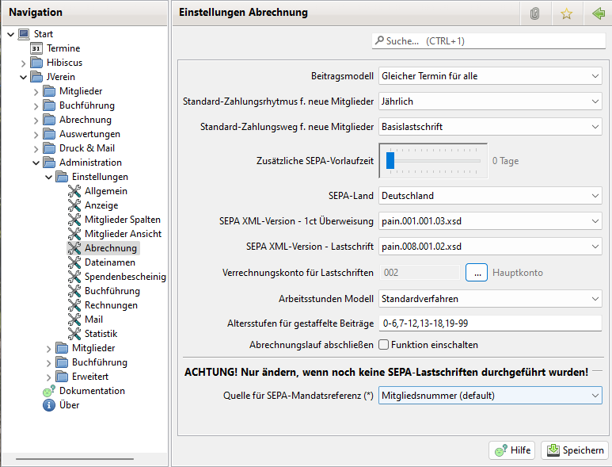

# Abrechnung

## Beitragsmodell

Beitragsmodell, siehe auch [Beitragsmodelle](../../../../allgemein/beitragsmodelle.md)

Die Standardwerte für den Zahlungsrhythmus und den Zahlungsweg bei der Speicherung neuer Mitglieder kann eingestellt werden.

## SEPA

Für die SEPA-Konvertierung ist das SEPA-Land auszuwählen.

SEPA XML-Version welche für die Generierung einer 1ct Überweisung (pain.001...) bzw. einer Lastschrift (pain.008...) XML Datei verwendet wird.

Unterstützte Versionen sind aus folgender Tabelle ersichtlich.

.png>)

## Verrechnungskonto für Lastschriften

Hier wird das Konto ausgewählt auf dem die beim Abrechnungslauf erzeugten Buchungen für Lastschriften erzeugt werden.

## Arbeitsstundenmodell

Mit dem Arbeitsstundenmodel wird die Buchung von Arbeitsstunden eingestellt.

Mögliche Werte sind:

### Standardverfahren

Es können beim Erfassen der Arbeitsstunden nur positive Werte im Stundenfeld eingegeben werden.

### Negative Stunden erlaubt

Beim Erfassen der Arbeitsstunden vom Mitgliedern können im Stundenfeld positive und negative Werte eingetragen werden. Positive und negative Werte können sich gegenseitig aufheben. Negative Werte können die Gesamtschuld an Arbeitsstunden bei einem Mitglied erhöhen und zu einer höheren Buchung von Zusatzbeiträgen führen.

## Altersstufen für gestaffelte Beiträge

Hier können für die Verwendung in gestaffelten Beiträgen die Altersbereiche eingegeben werden für die jeweils ein anderer Beitrag eingegeben werden kann.

## Abrechnungslauf abschließen

Funktionalität zum Abschließen von Abrechnungsläufen einschalten.

## Quelle für SEPA-Mandatsreferenz

Hier lässt sich auswählen wie die Mandats-ID beim Mitglied gebildet wird.

* Mitgliedsnummer
* Externe Mitgliedsnummer
* Individuelle ID (neu in Version 3.1.0)
