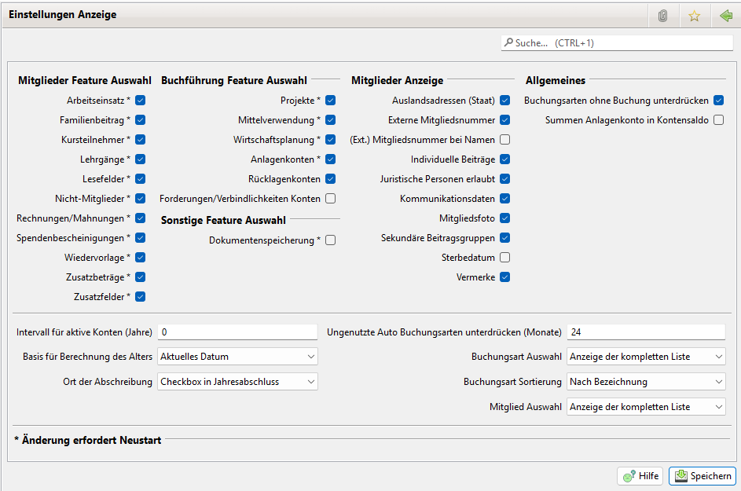

# Anzeige

Durch die Einstellungen kann das Verhalten von JVerein beeinflusst werden.

Nach Änderungen der mit Stern gekennzeichneten Werte ist ein Neustart von Jameica erforderlich.

Folgende Einstellungen können vorgenommen werden:

### Mitglieder Feature Auswahl

Hier können Feature aktiviert werden, die dann im Navigationsbaum unter den Mitgliedern verfügbar sind:
* Arbeitseinsatz: Unterstützung von Arbeitsstunden (siehe [Arbeitseinsätze](../../mitglieder/arbeitseinsatz.md))
* Familienbeitrag: Unterstützung von Familienbeitrag (siehe [Familienbeitrag](../../mitglieder/familienbeitrag.md))
* Kursteilnehmer: Unterstützung von Kursteilnehmern (siehe [Kursteilnehmer](../../mitglieder/kursteilnehmer.md))
* Lehrgänge: Unterstützung von Lehrgängen (siehe [Lehrgänge](../../mitglieder/lehrgange.md))
* Lesefelder: Unterstützung von Lesefeldern (siehe [Lesefelder](../mitglieder/lesefelder.md))
* Nicht-Mitglieder: Unterstützung von Nicht-Mitgliedern (siehe [Nicht-Mitglieder](../../mitglieder/nichtmitglieder.md))
* Rechnungen/Mahnungen: Unterstützung von Rechnungen und Mahnungen (siehe [Rechnung](../../mitglieder/rechnung.md))
* Spendenbescheinigungen: Unterstützung von Spendenbescheinigungen (siehe [Spendenbescheinigung](../../mitglieder/spendenbescheinigung.md))
* Wiedervorlage: Unterstützung von Wiedervorlage (siehe [Wiedervorlage](../../mitglieder/wiedervorlage.md))
* Zusatzbeträge: Unterstützung von Zusatzbeträgen (siehe [Zusatzbeträge](../../mitglieder/zusatzbetrage.md))
* Zusatzfelder: Unterstützung von Zusatzfeldern (siehe [Zusatzfelder](../mitglieder/felddefinition.md))

### Buchführung Feature Auswahl

Hier können Feature aktiviert werden, die dann im Navigationsbaum unter Buchführung verfügbar sind:
* Projekte: Unterstützung von Projekten (siehe [Projekte](../admbuchf/projekte.md))
* Mittelverwendung: Unterstützung der Mittelverwendungsrechnung (siehe [Mittelverwendung](../../buchf/mittelverwendung.md))
* Wirtschaftsplanung: Unterstützung der Wirtschaftsplanung (siehe [Wirtschaftsplanung](../../buchf/wirtschaftsplanung.md))
* Anlagenkonten: Unterstützung von Anlagenkonten (siehe [Konten](../../buchf/konten.md))
* Rücklagenkonten: Unterstützung von Rücklagenkonten (siehe [Konten](../../buchf/konten.md))
* Forderungen/Verbindlichkeiten Konten: Unterstützung von Forderungen und Verbindlichkeiten (siehe [Konten](../../buchf/konten.md))

### Sonstige Feature Auswahl

Hier können allgemeine Feature aktiviert werden:
* Dokumentenspeicherung: Unterstützung von Dokumentspeicherung bei Mitgliedern und Buchungen. Wird diese Einstellung aktiviert muss das Plugin jameica.messaging installiert sein.

### Mitglieder Anzeige

Hier kann eingestellt werden welche Information bei Mitgliedern verfügbar ist:
* Auslandsadressen (Staat): Eingabemöglichkeit von Staat
* Externe Mitgliedsnummer: Grundsätzlich zahlt das Mitglied den Beitrag, der in der Beitragsgruppe angegeben wurde. Sofern diese Option aktiviert wurde, kann bei jedem Mitglied ein abweichender individueller Beitrag angegeben werden
* (Ext.) Mitgliedsnummer bei Namen: Bei Auswahl dieser Option wird in Tabellen oder bei der Mitglieder Auswahl an den Mitglied Namen in Klammern die Mitgliedsnummer, oder falls Externe Mitgliedsnummer aktiviert ist, die externe Mitgliedsnummer angezeigt. Dies ist nützlich falls es mehrere Mitglieder mit dem gleichen Namen gibt. Diese lassen sich so unterscheiden
* Individuelle Beiträge: Grundsätzlich zahlt das Mitglied den Beitrag, der in der Beitragsgruppe angegeben wurde. Sofern diese Option aktiviert wurde, kann bei jedem Mitglied ein abweichender individueller Beitrag angegeben werden
* Juristische Personen erlaubt: Die Eingabe von Firmen, Organisationen und Behörden als Mitglieder wird erlaubt. Anstatt Name und Vorname werden Name-Zeile1 und Name-Zeile2 erfasst. Geburtsdatum und Geschlecht werden nicht erfasst
* Kommunikationsdaten: Beim Mitglied können folgende Kommunikationsdaten gepflegt werden: Private Telefonnummer, Handynummer, Dienstliche Telefonnummer, E-Mail Adresse
* Mitgliedsfoto: Zu jedem Mitglied kann ein Foto gespeichert werden
* Sekundäre Beitragsgruppen: Sekundäre Beitragsgruppen werden angeboten
* Sterbedatum: Das Eingabefeld für das Sterbedatum ist vorhanden und auswertbar
* Vermerke: Tab Vermerke beim Mitglied anzeigen. Beim Mitglied können 2 mal 255 Zeichen Vermerke gespeichert werden

### Allgemeines
* Buchungsart ohne Buchung unterdrücken: In Listen werden Buchungsarten ausgeblendet die im ausgewählten Zeitraum keine Buchung haben
* Summen Anlagenkonto in Kontensaldo: Im Kontensaldo werden die Anlagenkonten nicht einzeln aufgeführt sondern als ein Eintrag mit der Summe aller Anlagenkonten

### Intervall für aktive Konten (Jahre)

Im Kontoauswahldialog lassen sich Konten ausblenden auf denen länger als die konfigurierte Dauer an Jahren keine Buchungen mehr verbucht wurden. 

### Ungenutzte Auto Buchungsarten unterdrücken (Monate)

Im Buchungsarten Auswahl Dialogen lassen sich Buchungsarten ausblenden die mehr als die konfigurierte Anzahl an Monaten nicht mehr verwendet wurden. Die Unterdrückung wird nur auf Buchungsarten angewendet deren Status auf "Auto" steht. 

### Basis für Berechnung des Alters

In der Ansicht Tabellen kann in der Mitgliederliste in einer Spalte das Alter angezeigt werden. Hier mit diesem Feld bestimmen Sie welches Referenzdatum bei der Berechnung des Alters verwendet wird.Zur Auswahl stehen:

* Aktuelles Datum. Das Alter berechnet sich aus dem Geburtsdatum und dem aktuellen Datum.
* Jahres Start. Das Alter berechnet sich aus dem Geburtstag und dem 01.01. des aktuellen Jahres.
* Jahres Ende. Das Alter berechnet sich aus dem Geburtstag und dem 31.12. des aktuellen Jahres.

### Ort der Abschreibung

Hier lässt sich einstellen wie die Automatische Generierung von Abschreibungen gestartet werden kann:

* Button in Anlagen Buchungen: Über einen Button im Anlagenbuchungen View.
* Checkbox in Jahresabschluss: Über eine Checkbox im Jahresabschluss View.

### Buchungsart Auswahl

Hier kann eingestellt werden wie sich bei Buchungen das Feld für die Buchungsart verhält:

Bei Suche bei Eingabe tippt man den Wortteil der Bezeichnung der Buchungsart ein, nach ein paar Millisekunden wird einer Auswahlliste mit den Treffern angezeigt aus der man dann die gewünschte Buchungsart übernehmen kann.

Anzeige der kompletten Liste stellt eine Drop-Down-Liste mit allen Buchungsarten zur Verfügung.

### Buchungsart Sortierung

Wie sollen die Buchungsarten sortiert werden: nach Bezeichnung, nach Nummer oder nach Bezeichnung/Nummer.

### Mitglied Auswahl

Hier kann eingestellt werden wie sich bei der Suche nach Mitgliedern das Eingabefeld verhält:

Bei Suche bei Eingabe tippt man den Wortteil des Namens ein, nach ein paar Millisekunden wird einer Auswahlliste mit den Treffern angezeigt aus der man dann das gewünschte Mitglied übernehmen kann.

Anzeige der kompletten Liste stellt eine Drop-Down-Liste mit allen Mitgliedern zur Verfügung.
