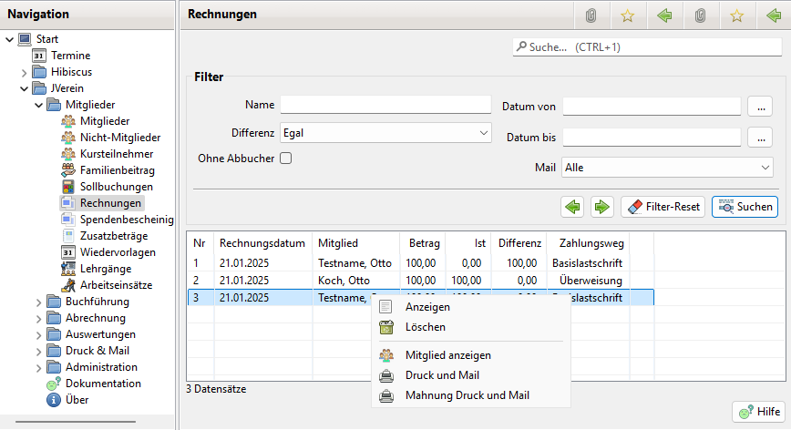

# Rechnungen

### Aktivierung

Zur Nutzung der Rechnungen ist die Option unter Administration->Einstellungen->Anzeige zu aktivieren.

Anschließend sollte JVerein neu gestartet werden, damit der Menüpunkt "Rechnungen" zur Verfügung steht.

### Allgemeines

In Version 3.0.0 von JVerein wurde das Konzept für Rechnungen komplett überarbeitet.

Rechnungen werden jetzt nicht mehr beim Drucken generiert, sondern werden wie Spendenbescheinigungen in der Datenbank gespeichert. Eine Rechnung ist dabei genau einer Sollbuchung zugeordnet. Um dennoch mehrere Forderungen wie z.B. Beiträge und Zusatzbeträge zu einer Rechnung zusammen fassen zu können wurde das Konzept der Sollbuchungspositionen eingeführt.

In einem Abrechnungslauf lassen sich jetzt Beiträge und Zusatzbeträge nicht nur für Lastschriften sondern auch für Sollbuchungen zusammen fassen. Die einzelnen Beiträge und Zusatzbeträge bilden dabei die Sollbuchungspositionen, wobei Positionen mit gleicher Buchungsart zu einer Position zusammen gefasst werden.

Die Sollbuchungspositionen werden dann als Rechnungspositionen in die Rechnung aufgenommen.

Beim versenden der Rechnung per Mail und wenn nur eine Rechnung als PDF erstellt wird, wird diese automatisch als E-Rechnung im ZUGFeRD Format erstellt.

Um Rechnungen erstellen zu können muss erst ein Formuler erstellt werden. Siehe [Formulare](../administration/mitglieder/formulare.md)

### Erstellung

Die Rechnungen können erstellt werden

* direkt während eines Abrechnungslauf (siehe [Abrechnung](../abrech/abrechnung.md) )
* aber auch in der Liste der Sollbuchungen (siehe [Sollbuchungen](mitgliedskonto.md))

## Liste der Rechnungen

Es gibt eine zentrale Übersicht über alle Rechnungen. Die Rechnungen können über einen Zeitraum oder über einen Namen, bzw. Namensfragment gefiltert werden. Zusätzlich kann angegeben werden, ob nur Rechnungen mit Differenzen zwischen Soll und Ist (Offene Posten oder Überzahlungen) angezeigt werden.

Zudem lässt sich filtern ob das Mitglied per Lastschrift zahlt oder eine Mail Adresse hat. Letzteres ist interessant wenn die Rechnungen per Mail versendet werden sollen.

Durch einen Doppelklick auf die Rechnung wird die Rechnung angezeigt.

Durch einen Rechtsklick auf eine Rechnung öffnet sich ein Kontextmenü mit mehreren Optionen:

* Anzeigen: Zeigt die Rechnung an
* Löschen: Löschen der selektierten Rechnungen
* Mitglied anzeigen: Öffnet das Mitglied zur Rechnung
* Druck und Mail: Wechselt in den Dialog zum Drucken und Mailen der Rechnung, siehe [Rechnungen](../druckmail/rechnungen.md)
* Mahnung Druck und Mail: Wechselt in den Dialog zum Drucken und Mailen einer Mahnung zur Rechnung, siehe [Mahnungen](../druckmail/mahnungen.md)

## Rechnung

Mit einem Doppelklick auf die Rechnung oder Klick auf Anzeigen wird die Rechnung angezeigt.

Folgende Buttons stehen zu Verfügung:

* Druck und Mail: Wechselt in den Dialog zum Drucken und Mailen der Rechnung, siehe [Rechnungen](../druckmail/rechnungen.md)
* Mahnung Druck und Mail: Wechselt in den Dialog zum Drucken und Mailen einer Mahnung zur Rechnung, siehe [Mahnungen](../druckmail/mahnungen.md)
* Speichern: Änderungen von Formular und Kommentar werden gespeichert
