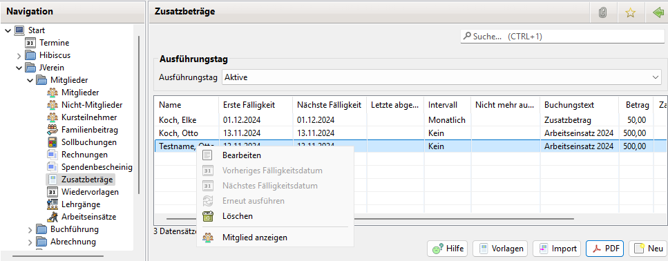
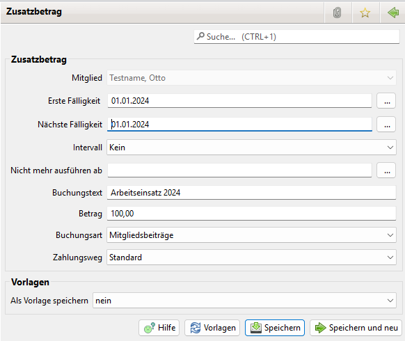

# Zusatzbeträge

### Aktivierung

Zur Nutzung der Zusatzbeträge ist die Option unter Administration->Einstellungen->Anzeige zu aktivieren. 

Unter Administration->Einstellungen->Abrechnung kann auch eingestellt werden, ob Zusatzbeträge auch bei ausgetretenen Mitgliedern abgerechnet werden sollen.

Anschließend sollte JVerein neu gestartet werden, damit der Menüpunkt "Zusatzbeträge" zur Verfügung steht.

### Allgemeines

Für jedes Mitglied können Zusatzbeträge hinterlegt werden. Diese Beträge werden zusätzlich zum Mitgliedsbeitrag eingezogen. Die Abrechnungen können einmalig (z. B. Eigenanteil für die Teilnahme an einer Veranstaltung) oder wiederkehrend (z. B. Instrumentenversicherung) angelegt werden.

Als Wiederholungs-Intervall stehen zur Auswahl:

* monatlich
* zweimonatlich
* vierteljährlich
* halbjährlich
* jährlich

Beim Buchungstext können die allgemeinen Variablen verwendet werden.

### Erstellung

Die Zusatzbeträge können erstellt werden

* in den Mitglied Details (siehe [Zusatzbeträge](content/zusatzbeitraege.md))
* über das Kontextmenü eines Mitglieds (siehe [Zusatzbeträge](zusatzbetrage.md))
* in der Liste der Zusatzbeträge über den "Neu" Button
* aber auch durch Importieren über den Button "Importieren" in der Liste der Zusatzbeträge (Siehe [Zusatzbeträge Importieren](zusatzbetrage-importieren.md))

## Liste der Zusatzbeträge

Der Übersicht View für Zusatzbeträge zeigt alle vorhandenen Zusatzbeträge an.

Über den Filterbereich lässt sich nach verschiedenen Kriterien filtern.

Der Ausführungstag bietet folgende Optionen:

* Alle: Es werden alle vorhandenen Zusatzbeträge angezeigt
* Aktive: Es werden alle Zusatzbeträge angezeigt die noch in Abrechnungen berücksichtigt werden. Also keine einmaligen Zusatzbeträge mehr die schon ausgeführt wurden oder bei periodischen, keine mehr, bei denen die nächste Fälligkeit zum oder nach dem Endedatum liegt. Ob ein Zusatzbetrag beim einem Abrechnungslauf zum aktuellen Datum abgerechnet würde hängt von seiner nächsten Fälligkeit ab
* Noch nicht ausgeführt: Einmalige Zusatzbeträge die noch nicht ausgeführt wurden
* Liste mit Datum: Die Liste enthält Datum Einträge von kürzlich ausgeführten Abrechnungen

In der Tabelle werden folgende Spalten angezeigt:

* Name: Name des Mitglieds
* Erste Fälligkeit: Datum der ersten Fälligkeit des Zusatzbetrags
* Nächste Fälligkeit: Datum der nächsten Fälligkeit. Wird ein Abrechnungslauf mit Fälligkeit zu diesem oder einen späteren Datum durchgeführt, so wird der Zusatzbetrag mit abgerechnet und dieses Feld um das Intervall des Zusatzbetrags erhöht.
* Letzte abgerechnete Fälligkeit: Das Fälligkeitsdatum des letzten Abrechnungslaufes. Zu diesem Termin wurde das der nächsten Fälligkeit vorangegangene Intervall abgerechnet
* Intervall für eine periodischen Zusatzbetrag
* Nicht mehr ausführen ab: Der Termin ab dem der Zusatzbetrag nicht mehr abgerechnet wird. Der Zusatzbetrag wir nicht mehr abgerechnet wenn der Termin der nächsten Fälligkeit zu diesem Datum oder danach liegt
* Buchungstext: Text der im Zweck der Sollbuchung erscheint
* Betrag: Betrag der zu zahlen ist
* Zahlungsweg: Zahlungsweg für die Buchung
* Buchungsart: Buchungsart

Folgende Buttons stehen zu Verfügung:

* Vorlagen: Zeigt die Liste der verfügbaren Vorlagen an. Siehe [Zusatzbeträge Vorlagen](zusatzbetragevorlage.md)
* Importieren: Damit können Zusatzbeträge aus einer Datei importiert werden. Siehe [Zusatzbeträge Importieren](zusatzbetrage-importieren.md)
* PDF: Liste der Zusatzbeträge als PDF exportieren
* Neu: Damit kann ein neuer Zusatzbetrag eingerichtet werden.

Durch einen Doppelklick wird die Bearbeitung eines Zusatzbetrag eingeleitet.

Das Kontextmenü bietet folgende Optionen:

* Bearbeiten: Der ausgewählte Eintrag wird zum Bearbeiten geöffnet
* Vorheriges Fälligkeitsdatum: Das Fälligkeitsdatum um ein Intervall zurücksetzen, dadurch wird der Zusatzbetrag ein weiteres mal abgerechnet. (nur bei Zusatzbeträgen mit Wiederholung)
* Nächstes Fälligkeitsdatum: Das Fälligkeitsdatum um ein Intervall in die Zukunft verschieben. Dadurch wird die Abrechnung einmal ausgesetzt. (nur bei Zusatzbeträgen mit Wiederholung)
* Erneut ausführen: Zusatzbeitrag erneut ausführen (nur bei Zusatzbeträgen ohne Wiederholung)
* Löschen: Damit kann ein Zusatzbetrag gelöscht werden
* Mitglied anzeigen: Damit können die Daten des Mitglieds angezeigt werden

## Zusatzbetrag

Mit einem Klick auf Neu oder Bearbeiten öffnet sich folgender Dialog:

PS: Ab JVerein 3.0.0 lässt sich für den Zusatzbetrag ein von der Konfiguration beim Mitglied (Standard) abweichender Zahlungsweg konfigurieren.

## Abrechnung

Bei der Abrechnung finden folgende Prüfungen statt:

* Liegt das Fälligkeitsdatum auf dem Datum "Nicht mehr ausführen ab" oder danach: Keine Berechnung
* Liegt das Fälligkeitsdatum auf dem Stichtagsdatum oder davor: Berechnung. Auf das Fälligkeitsdatum wird das Intervall addiert.

### Beipiel 1

Nächste Fälligkeit: 1.11.2008

Nicht mehr ausführen ab: 1.11.2008

Intervall: Monatlich

-> keine Berechnung

### Beispiel 2

Nächste Fälligkeit: 1.11.2008

Nicht mehr ausführen ab: 1.1.2009

Intervall: Monatlich

Stichtagsdatum: 1.11.2008 -> Berechnung

Anschließend wird das Fälligkeitsdatum auf den 1.12.2008 gesetzt. Am oder nach dem 1.12.2008 findet die nächste Berechnung statt.

Danach wird das Fälligkeitsdatum auf den 1.1.2009 gesetzt.....

## Vorlagen

Bei den Zusatzbeträgen gibt es den Button Vorlagen Damit wird eine Liste der gespeicherten Vorlagen aufgerufen. Mit einem Doppelklick wird eine Vorlage ausgewählt.

Bei der Erfassung von Zusatzbeträgen kann angegeben werden, ob der Zusatzbetrag als Vorlage gespeichert werden soll. Dabei kann angegeben werden, ob Datumsangaben mitgespeichert werden sollen.
