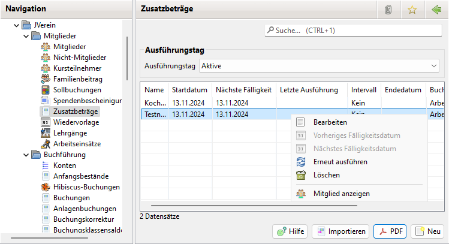
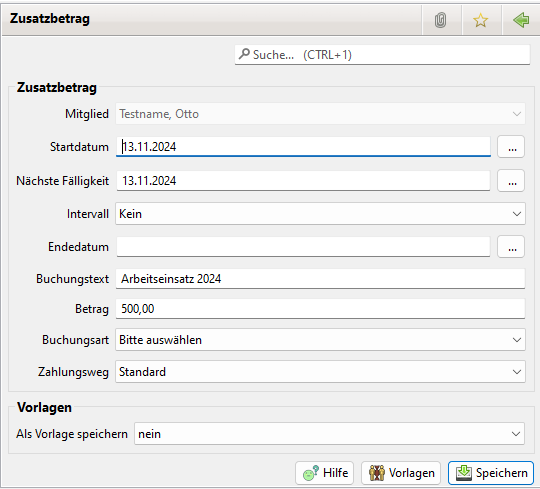

# Zusatzbeträge

### Aktivierung

Zur Nutzung der Zusatzbeträge ist die Option in den Einstellungen->Administration->Einstellungen zu aktivieren.

Anschließend sollte JVerein neu gestartet werden, damit der Menüpunkt "Zusatzbeträge" zur Verfügung steht.

### Allgemeines

Für jedes Mitglied können Zusatzbeträge hinterlegt werden. Diese Beträge werden zusätzlich zum Mitgliedsbeitrag eingezogen. Die Abrechnungen können einmalig \(z. B. Eigenanteil für die Teilnahme an einer Veranstaltung\) oder wiederkehrend \(z. B. Instrumentenversicherung\) angelegt werden. \(Die Zusatzbeträge-Sektionen werden in JVerein nur angezeigt, wenn unter Jameica/JVerein/Administration/Einstellungen/Anzeige der Haken bei "Zusatzbeträge anzeigen" gesetzt ist.\)

Als Wiederholungs-Intervall stehen zur Auswahl:

* monatlich
* zweimonatlich
* vierteljährlich
* halbjährlich
* jährlich

Beim Buchungstext können die allgemeinen Variablen verwendet werden.

### Erstellung 

Die Zusatzbeträge können erstellt werden
* in den Mitglied Details (siehe [Zusatzbeträge](content/zusatzbeitraege.md)) 
* über das Kontextmenü eines Mitglieds (siehe [Mitglieder](content/mitglieder.md)) 
* in der Liste der Zusatzbeträge über den "Neu" Button
* aber auch durch Importieren über den Button "Importieren" in der Liste der Zusatzbeträge (Siehe [Zusatzbeträge Importieren](zusatzbetrage-importieren.md))

## Liste der Zusatzbeträge

Der Übersicht View für Zusatzbeträge zeigt alle vorhandenen Zusatzbeträge an.

Über den Filterbereich lässt sich nach verschiedenen Kriterien filtern.

Folgende Buttons stehen zu Verfügung:
* Importieren: Damit können Zusatzbeträge aus einer Datei importiert werden. Siehe [Zusatzbeträge Importieren](zusatzbetrage-importieren.md)
* PDF: Liste der Zusatzbeträge als PDF exportieren
* Neu: Damit kann ein neuer Zusatzbetrag eingerichtet werden.

Durch einen Doppelklick wird die Bearbeitung eines Zusatzbetrag eingeleitet.

Das Kontextmenü bietet folgende Optionen:
* Bearbeiten: Der ausgewählte Eintrag wird zum Bearbeiten geöffnet
* Vorheriges Fälligkeitsdatum:  Vorheriges Fälligkeitsdatum setzen
* Nächstes Fälligkeitsdatum:  Nächstes Fälligkeitsdatum setzen
* Erneut ausführen:  Zusatzbeitrag erneut ausführen
* Löschen: Damit kann ein Zusatzbetrag gelöscht werden
* Mitglied anzeigen: Damit können die Daten des Mitglieds angezeigt werden

## Zusatzbeitrag

Mit einem Klick auf Neu oder Bearbeiten öffnet sich folgender Dialog:

## Abrechnung

Bei der Abrechnung finden folgende Prüfungen statt:

* Liegt das Fälligkeitsdatum auf dem Endedatum oder danach: Keine Berechnung
* Liegt das Fälligkeitsdatum auf dem Stichtagsdatum oder davor: Berechnung. Auf das Fälligkeitsdatum wird das Intervall addiert.

### Beipiel 1

Fälligkeitsdatum: 1.11.2008

Endedatum: 31.10.2008

-&gt; keine Berechnung

### Beispiel 2

Fälligkeitsdatum: 1.11.2008

Endedatum: 31.12.2100

Intervall: Monatlich

Stichtagsdatum: 1.11.2008 -&gt; Berechnung

Anschließend wird das Fälligkeitsdatum auf den 1.12.2008 gesetzt. Am oder nach dem 1.12.2008 findet die nächste Berechnung statt.

Danach wird das Fälligkeitsdatum auf den 1.1.2009 gesetzt.....

## Vorlagen

Bei den Zusatzbeträgen gibt es den Button Vorlagen Damit wird eine Liste der gespeicherten Vorlagen aufgerufen. Mit einem Doppelklick wird eine Vorlage ausgewählt.

Bei der Erfassung von Zusatzbeträgen kann angegeben werden, ob der Zusatzbetrag als Vorlage gespeichert werden soll. Dabei kann angegeben werden, ob Datumsangaben mitgespeichert werden sollen.

