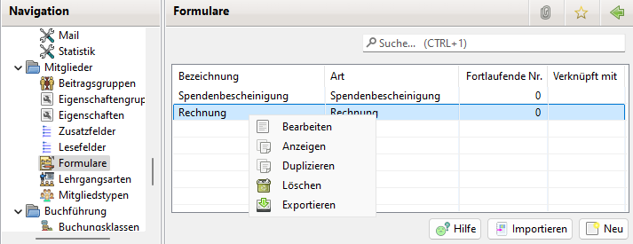
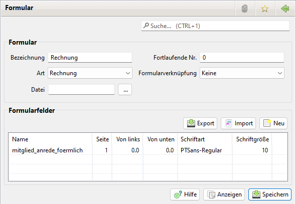
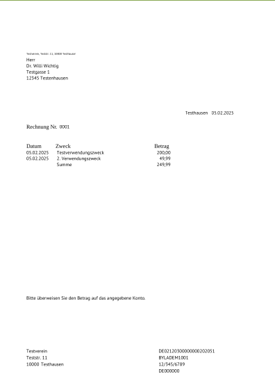

# Formulare

## Allgemeines

In JVerein werden für [Spendenbescheinigungen](../../mitglieder/spendenbescheinigung.md), [Mahnung](../../druckmail/mahnungen.md), [Rechnungen](../../druckmail/rechnungen.md), [Pre-Notification](../../druckmail/pre-notification.md) und diverse Zwecke  [Freie Formulare](../../druckmail/freiesformular.md) hinterlegt.

## Liste der Formulare

Mit Neu kann ein neues Formular eingerichtet werden.

Durch einen Doppelklick wird die Bearbeitung eines Formular eingeleitet.

Das Kontextmenü bietet folgende Optionen:
* Bearbeiten: Der ausgewählte Eintrag wird zum Bearbeiten geöffnet
* Anzeigen: Das fertige Formular wird als PDF generiert und angezeigt
* Duplizieren: Es wird eine Kopie des Formulars erzeugt
* Löschen: Damit kann ein Formular, welches noch nicht verwendet wurde, gelöscht werden
* Exportieren: Damit können die selektierten Formulare inklusive Formular Datei und Formularfelder exportiert werden

Mit dem Button Importieren können vorher exportierte Formulare importiert werden.

## Formular

Über die Funktion Neu oder Bearbeiten wird ein Formular Dialog angezeigt.

Der Dialog beinhaltet die Formular Attribute und zeigt eine Liste der Formularfelder die auf die Datei Vorlage gedruckt werden sollen.

## Formular Attribute

### Bezeichnung

Name des Formulars.

### Art

Art des Formulars. Es gibt an für welche Ausgabe das Formular verwendet werden kann. Optionen sind:
* Spendenbescheinigung
* Rechnung
* Mahnung
* Freies Formular
* Sammelspendenbescheinigung
* SEPA-Prenotification

### Datei

Hintergrund Datei für das Formular.

Man erstelle ein einfaches Dokument/Formular in Word, Open-/LibreOffice oder was auch immer \(Dankeschönschreiben, Rundschreiben, whatsoever...\) und lasse an den entsprechenden Stellen im Schreiben einfach leeren Platz \(weisse unbeschriebene Stellen\) als Platzhalter für die später von JVerein einzufügenden Daten.

Macht Euch hier genau Gedanken, wie Euer Formular aussehen soll und was Ihr später alles an Daten einfügen möchtet.

Bitte in der Textverarbeitungssoftware KEIN FORMULAR erstellen - nur einfach ein Dokument mit weißen/leeren Stellen als Platzhalter für später!! Das reicht.

Nun muss aus dem Dokument noch ein PDF gemacht werden. Das geht mit einem virtuellen PDF-Drucker \(z.B. FreePDF XP oder PDFCreator\) oder mit Adobe Acrobat \(nicht mit dem Reader, der kann halt nur lesen :-\) \) oder einfach in Open-/LibreOffice mit dem PDF-Export. Das fertige PDF \(mit den weißen/leeren Stellen für die späteren Daten aus jVerein\) hat keinerlei Funktionen eingebaut \(keine Formularfelder, nur weiße/leere Stellen im Text an der richtigen Stelle\).

Dann erstellt man in JVerein unter "Administration-&gt;Formulare" ein neues Formular. Dazu unten auf "neu" gehen, Bezeichnung und Art auswählen \("Art" gibt an, wann und wo dieses Formular in JVerein verfügbar sein wird\).

Nun noch die gerade erstellte PDF-Datei auswählen und auf "speichern" klicken.

### Fortlaufende Nummer

Fortlaufende Nummer z.B. bei Rechnungen. Über das Feld lässt sich die Nummer zurücksetzen.

### Formularverknüpfung

Formulare können verknüpft werden um Abhängigkeiten untereinander aufzubauen. Die Spalte "Verknüpft mit" in der Formular-Übersicht zeigt die Abhängigkeiten an. Bei verknüpften Formularen werden die fortlaufenden Nummern (Formularfeld "zaehler") gleichgesetzt und untereinander aktualisiert. Eine Vererbung der Verknüpfung ist nicht implementiert. Formulare können nicht mit sich selbst verknüpft werden. Ein verknüpftes Formular kann nicht gelöscht werden, bis die Abhängigkeiten entfernt wurden.

## Formular Buttons

### Anzeigen

Das fertige Formular wird als PDF generiert und angezeigt.

### Speichern

Nach Eingabe oder ändern der Formular Attribute muss das Formular gespeichert werden.

## Formularfelder

Bevor Formularfelder angelegt werden können muss das Formular gespeichert werden.

Nun kommt die eigentliche Arbeit:

Bei den Formularfelder Buttons  klickt Ihr auf "Neu", um das erste einzufügende Datenfeld auszuwählen und zu positionieren: \(Die spätere Reihenfolge Eurer Datenfelder ist egal! Ihr könnt auch erst hinten anfangen\)

### Name

Unter "Name" könnt Ihr nun aus den möglichen Datenfelder dasjenige aus der Datenbank auswählen, das eingefügt werden soll.

### Seite

Seite auf der das Formularfeld platziert werden soll.

### Von links, Von unten

Dieses Datenfeld müsst Ihr nun Millimetergenau auf euer gerade eben generiertes PDF händisch setzen. der Punkt \(0,0\) liegt unten links auf der Seite!

Tipp: Druckt das Dokument aus und messt mit einem Lineal die Positionen aus.

Speichert das Ganze und zeigt euch das Ergebnis über den Anzeigen Button an.

Das müsst Ihr solange wiederholen, bis das Datenfeld an der richtigen Stelle eingefügt wurde.

Übrigens: Da das System noch nicht weiß, welchen Datensatz es beim Austesten nehmen soll, hat der Entwickler einen Dummy-Datensatz automatisch für das Erstellen und Testen des neuen Formulars bereitgestellt.

### Schriftart

Schriftart für den Text.

### Schriftgröße

Schriftgröße des Textes.

## Formularfelder Buttons

### Export

Exportiert die Formularfelder des aktuellen Formulars.

### Import

Importiert Formularfelder aus einer Datei die mit Export erzeugt wurde. Es werden alle bestehenden Formularfelder der aktuellen Formulars vor dem Import gelöscht.

### Neu

Erzeugt ein neues Formularfeld für das aktuelle Formular.

## Verfügbare Formularfelder

Als Formularfelder können alle Variablen verwendet werden. Siehe [Variablen](../../../sonstiges/variable.md)

## Vorlagen

Hier einige Vorlagen zum so verwenden oder weiter anpassen. Sie können herunter geladen und als Formular importiert werden.

Einfache Standardrechnung

## Beispiele

