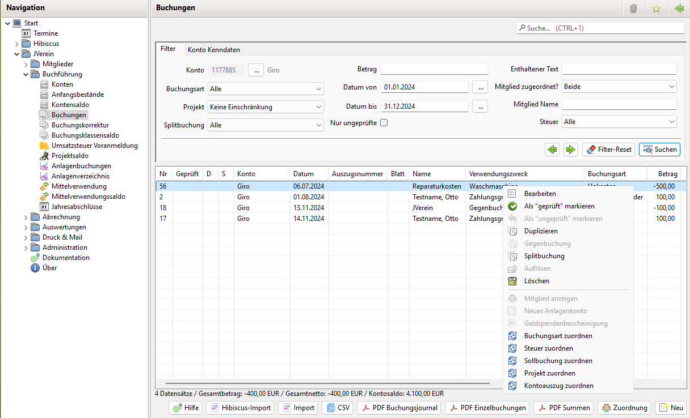
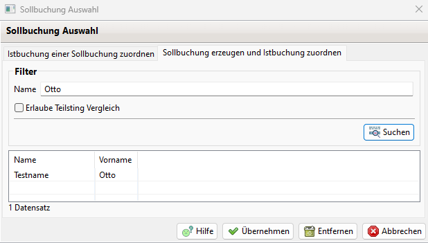
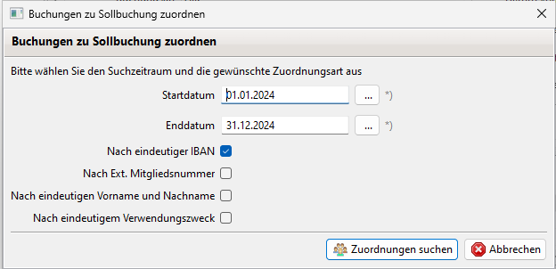
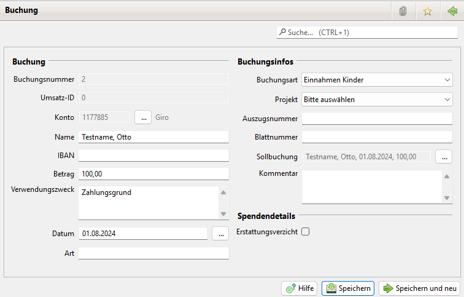

# Buchungen

## Liste der Buchungen

Die im System gespeicherten Buchungen können nach folgenden Kriterien selektiert werden:

* Konto
* Buchungsart
* Projekt
* Von Datum
* Bis Datum
* Betrag, hier können auch die Vergleichsoperatren >, <, <=, >=, | (Absolut Betrag), .. (Bereich zB. 10..100) verwendet werden
* Enthaltener Text
* Mitglied zugeordnet
* Splitbuchungen: nur Split oder nur Hauptbuchungen

In Der Buchungsliste bedeutet die Spalte "S" Splitbuchung, folgende Werte sind möglich "S" Slitbuchung, "H" Hautbuchung, "G" Gegenbuchung.

Mit einem Doppelklick auf eine Buchung wird die Detailansicht zur Bearbeitung geöffnet. Mit einem rechten Mausklick öffnet sich ein Kontextmenü. Damit können Buchungen bearbeitet werden und bestehende Buchungen gelöscht werden. Der Export der Daten ins PDF oder CSV Format wird durch einen Klick auf PDF/CSV angestoßen.

Folgende Buttons sind vorhanden:

* Hibiscus-Import: Import von Buchungen aus Hibiscus. Siehe [Buchungsübernahme](buchungsubernahme.md)
* Import: Import von Buchungen aus einer CSV Datei. Siehe [Buchungsimport](../../allgemeine-funktionen/buchf/buchungsimport.md)
* CSV: Die über die Suchkriterien ausgewählten Buchungen können mit einem Klick auf CSV als CSV-Datei ausgegeben werden. Dabei werden bei Nutzung des Mitgliedskontos ggfls. auch die Daten des Mitgliedes ausgegeben.
* PDF Buchungsjournal: Auflistung aller Buchungen nach verschiedenen Sortierungen
* PDF Einzelbuchungen: Auflistung aller Buchungen nach Buchungsarten
* PDF Summen: Ausgabe der Summen pro Buchungsart
* Zuordnung: Zuordnung von Buchungen zu Sollbuchungen (siehe unten)
* Neu: Neue Buchung erzeugen

Die PDF-Auswertungen sind hier abrufbar. Ausführlich beschrieben werden sie im Artikel [Buchführung Zusammenhänge](../../sonstiges/buchfuhrung-zusammenhange.md).

Folgende Menü Einträge sind vorhanden:

* Bearbeiten: Öffnet die Detailansicht für die selektierte Buchung
* Duplizieren: Öffnet die Detailansicht für eine neue Buchung mit den Daten der selektierten Buchung
* Gegenbuchung: Öffnet die Detailansicht für eine neue Buchung um eine Gegenbuchung zur selektierten Buchung zu erstellen Der Menüpunkt ist nur verfügbar wenn die Buchungsart der selektierten Buchung der Art "Umbuchung" ist. In der Gegenbuchung ist der negative Betrag der selektierten Buchung eingetragen. Nach Auswahl der Aktion wird erst ein Dialog zur Auswahl des Gegenkontos geöffnet. Dieser Dialog wird übersprungen wenn in der Konfiguration eines Kontos die Buchungsart der selektierten Buchung konfiguriert ist. In diesem Fall wird sofort das entsprechende Konto eingetragen. Siehe [Konten](konten.md).
* Splitbuchung: Erzeugt eine Splitbuchung. Siehe [Splittbuchungen](../../allgemeine-funktionen/buchf/splittbuchungen.md)
* Auflösen: Löst eine oder mehrere selektierte Splitbuchungen auf. Es werden die Gegenbuchung und die enthaltenen Buchungen gelöscht
* Löschen: Löscht die Buchung
* Mitglied anzeigen: Für die selektierte Buchung wird das zugehörige Mitglied geöffnet, sofern der Buchung eine Sollbuchung zugeordnet wurde.
* Neues Anlagenkonto: Für die selektierte Buchung wird ein Anlagenkonto erzeugt
* Buchungsart zuordnen: Es öffnet ein Dialog zur Zuordnung einer Buchungsart
* Sollbuchung zuordnen: Es öffnet ein Dialog zur Zuordnung einer Sollbuchung (siehe unten)
* Projekt zuordnen: Es öffnet ein Dialog zur Zuordnung eine Projekts
* Kontoauszug zuordnen: Es öffnet ein Dialog zur Zuordnung eines Kontoauszugs

Buchungen können nur neu aufgenommen, geändert oder gelöscht werden, wenn sie nicht durch einen [Jahresabschluss](jahresabschluss.md) abgeschlossen wurden.

## Zuordnung einer Buchung zu einer Sollbuchung

Durch einen Klick auf auf den Menüeintrag "Sollbuchung zuordnen" öffnet sich folgender Dialog:

Der Name aus der Buchung wird in das Namensfeld übernommen. Der Inhalt wird in Wörter zerlegt und in den Spalten Name und Vorname gesucht.

Zur Filterung des Buchungen steht weiterhin Egal (= eine beliebige Differenz), Fehlbetrag oder Überzahlung zur Verfügung. Durch einen Klick auf entfernen wird die Mitgliedskontoinformation aus der Buchung entfernt. Damit können Fehleingaben korrigiert werden.

Der obige Dialog hat zwei Registerkarten:

* Istbuchung einer Sollbuchung zuordnen (Option 1)
* Sollbuchung erzeugen und Istbuchung zuordnen (Option 2)

Die erste Karte dient der Zuordnung einer Istbuchung auf eine vorhandene Sollbuchung (z.B. aus einem Abrechnungslauf). Beim zuordnen wird die Buchung automatisch anhand der Sollbuchungen gesplittet und den Buchungsarten zugeordnet. Wenn ber Betrag nicht der der Sollbuchung entsricht, wird vorher gefragt, ob eine Restbuchung erstellt werden soll. Hinweis: Wenn ja ausgewählt wird, ist die Sollbuchung ausgeglichen da die Restbuchung nicht dem Mitglied zugeornet wird. Bei "Nein" wird die Buchung ohne Spliten zugeordnet.

Es kann auch eine Buchung mehreren Sollbuchungen auf einmal zugeordnet werden, dann wir diese entsprechen gesplittet. Auch das zuordnen mehrerer Buchungen zu einer Sollbuchung ist möglich, dabei wird jedoch kein automatisches Splitten durchgeführt..

Auf der zweiten Karte kann alternativ in einem Schritt automatisch zuerst eine (neue) Sollbuchung erzeugt werden und dieser dann sogleich die Istbuchung zugeordnet werden. So können z.B. Spenden bequem bei einem Mitglied oder Nicht-Mitglied verbucht werden.

Hier kann nur nach dem Namen gefiltert werden.

In der zweiten Karte kann zusätzlich "Erlaube Teilstring Vergleich" an gehakt werden. Mit dieser Option werden auch Namensteile gefunden (Suchbegriff "Anna" liefert alle Mitglieder in deren Vor- oder Nachname anna, bspw. Hannah Muster, Anna Test, Maria Hannauer...). Sonst werden nur vollständige Namen gefunden (Suchbegriff "Max Mustermann" findet alle Mitglieder deren Vor- oder Nachname genau Max ist oder deren Vor- oder Nachname exakt Mustermann ist, bspw. Max Mustermann, Anna Mustermann, Karl Max).

## Automatische Zuordnung von Buchungen zu Sollbuchungen

In der Ansicht Buchführung -> Buchungen gibt es den Button "Zuordnung", mit dem eine automatische Zuordnung von Buchungen zu Sollbuchungen vorgenommen werden kann. Diese kann auf Basis einer eindeutigen IBAN, der Mitgliedsnummer im Verwendungszweck und/oder den eindeutigen Vor- und Nachname im Verwendungszweck vorgenommen werden. Über das Start- und Enddatum kann der Suchbereich von aktiven Mitgliedern, Buchungen und Sollbuchungen eingeschränkt werden.

Folgende Zuordnungsregeln bestehen:

* Ist eine IBAN, oder der Vor- und Nachname über den angegeben Suchzeitraum eines aktiven Mitglieds nicht eindeutig, findet keine Zuordnung mit dieser Zuordnungsart für dieses Mitglied statt.
* Wurden mehrere Zuordnungsarten auf einmal angegeben (IBAN, Mitgliedsnummer, Vor- und Nachname) wird eine Zuordnung in der genau dieser Reihenfolge versucht.
* Wurde unter Administration -> Einstellungen -> Anzeige „externe Mitgliedsnummer“ angegeben, wird anstatt der Mitgliedsnummer mit der externe Mitgliedsnummer im Verwendungszweck gesucht, falls diese Zuordnungsart gewählt wurde findet eine Zuordnung nur statt, wenn sowohl das Mitglied als auch die Sollbuchung den Zahlungsweg Überweisung aufweist.
* Der Betrag der Buchung muss genau mit dem offenen Betrag der Sollbuchung übereinstimmen, damit eine Zuordnung erfolgt.
* Gibt es mehrere Buchungen und Sollbuchungen, die in den angegebenen Zeitraum passen würden, erfolgt die Zuordnung mit dem jeweils ältesten zuerst.

Nach der Suche wird ein Dialog angezeigt, der die Zuordnungen dem Nutzer präsentiert. Dieser kann diese Zuordnungen auf Wunsch dann persistieren lassen.

## Buchung

Siehe auch [Sollbuchungen](../../v3.1.x/mitglieder/mitgliedskonto.md), [Splittbuchungen](../../allgemeine-funktionen/buchf/splittbuchungen.md)
