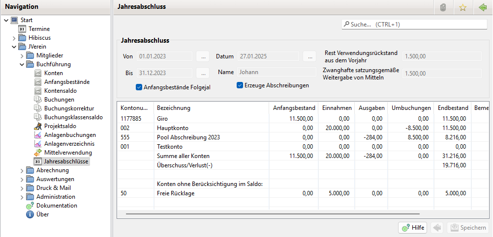

# Jahresabschluss

## Liste der Jahresabschlüsse

Zunächst wird eine Liste der bereits getätigten Jahresabschlüsse angezeigt:

Damit ein Jahresabschluss verbucht werden kann, müssen folgende Bedingungen erfüllt sein:

* Für jedes Konto muss ein Jahresanfangsbestand existieren
* Alle Buchungen müssen einer Buchungsart zugeordnet worden sein.
* Die Abschlüsse müssen in chronologischer Reihenfolge erfolgen.

Über das Kontextmenü kann jeweils nur der neuste Jahresabschluss gelöscht werden.

## Jahresabschluss

Durch eine Klick auf Neu kann ein neuer Jahresabschluss vorgenommen werden:

Der Jahresabschluss zeigt den Zeitraum des Jahresabschlusses an. Es ist das Geschäftsjahr nach dem letzten Abschluss.

Bei Name sollte der Name desjenigen eingetragen werden, der den Abschluss durchführt.

Tipp: Die Checkbox "Anfangsbestände Folgejahr" sollte aktiviert werden. Damit werden die Endstände in der Liste der Anfangsbestände abgespeichert und als Basis für das nächste Geschäftsjahr verwendet. Auch das Anlagenverzeichnis verwendet die Anfangsbestände.

Ist in den [Einstellungen](../administration/einstellungen/anzeige.md) der Ort der Abschreibung auf "Checkbox in Jahresabschluss" konfiguriert, wird hier auch die Checkbox "Erzeuge Abschreibungen" sichtbar. Ist sie gewählt, werden automatisch die AfA Abschreibungen generiert.

Die Felder:
* Rest Verwendungsrückstand Vorjahr
* Zwanghafte satzungsgemäße Weitergabe von Mitteln
werden nur angezeigt wenn [Mittelverwendung](mittelverwendung.md) aktiviert ist.

