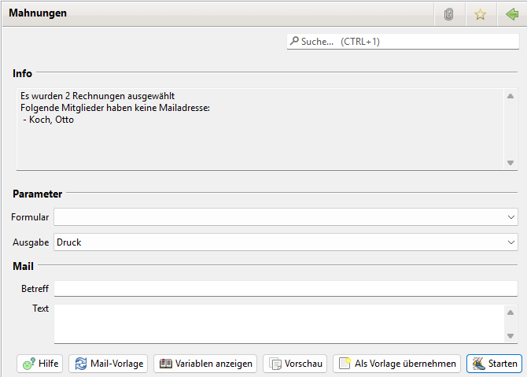
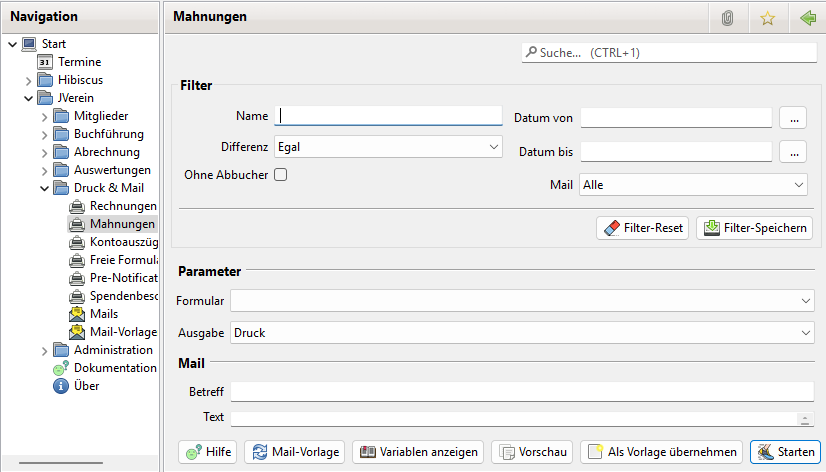

# Mahnungen drucken/mailen

## Allgemeines

Für alle offenen Rechnungen können Mahnungen erstellt werden. Dabei hat man die Möglichkeit eine Mahnung selektiv oder automatisch zu erstellen. Eine Buchung ist offen, wenn der Betrag der Spalte Zahlungseingang kleiner ist als der Wert in der Spalte Betrag.

Ein Mahnung kann ein PDF Dokument sein das direkt aus JVerein erstellt wird oder Sie exportieren die Daten in eine CSV Datei und erstellen die Mahnung als Serienbrief mit z.B. Microsoft Office oder Open Office.

## Mahnungen selektiv erstellen

Möchten Sie eine Mahnung selektiv erstellen, so öffnen Sie den Dialog Rechnungen. Wählen Sie den Filter so, dass die gewünschten Daten angezeigt werden. Selektieren Sie einen oder mehrere Einträge und drücken die rechte Maustaste. Es öffnet sich ein Kontext-Menü. Wählen Sie hier den Menüpunkt "Mahnung Druck und Mail". Es öffnet sich hier der Dialog Mahnung der Sie bei der Erstellung der Mahnung unterstützt.

Hier lässt sich bei der Ausgabe zwischen Drucken oder Versenden per Mail wählen.

Im Info Feld wird angezeigt wie viele Rechnungen selektiert wurden und ob zugehörige Mitglieder keine Mailadresse haben. Haben sie keine Mail Adresse werden sie beim Versand per Mail ignoriert.

Im Parameter Feld "Formular" ist ein Formular auszuwählen. Dieses muss gegebenenfalls erstellt werden. Siehe [Formulare](../administration/mitglieder/formulare.md).

Im Parameter Feld "Ausgabe" lässt sich wählen ob die Mahnungen als PDF gedruckt oder per Mail verschickt werden sollen.

Im Falle des Mail Versand sind die Felder Betreff und Text auszufüllen.

Über die Buttons lässt sich eine gespeicherte Mailvorlage auswählen bzw. die Mahnung exportieren.

Das drücken des Startknopf löst im Fall der Mail Ausgabe bei korrekt eingestellten Mail-Server-Daten den Versand der Mails aus. Es ist daher ratsam, diese Funktion im Vorfeld zu testen, ohne mit echten Mitgliederdaten/Mails zu hantieren.

## Mahnungen automatisch erstellen

Um automatisch Mahnungen zu erstellen wählen Sie im Navigations Baum dem Menü Eintrag "Mahnungen" aus. Es öffnet sich ebenfalls der Dialog Mahnungen.

Im Gegensatz zum selektiven Erstellen wird hier der gleiche Filter Bereich angezeigt wie im Sollbuchungen Dialog. Es werden dann Mahnungen für alle Sollbuchungen die die Filter Kriterien erfüllen gedruckt bzw. per Mail versendet.

Der Filter Bereich bietet folgende Optionen:
* Name: Der Name eine Mitglieds.
* Differenz: Bei "Fehlbetrag" werden nur Kontoauszüge für Mitglieder erstellt wenn ein Fehlbetrag vorliegt und bei "Überzahlung" nur wenn überzahlt wurde. Bei "Egal" wird nicht auf den Betrag geprüft.
* Ohne Abbucher: Schließt Mitglieder die per Lastschrift bezahlen aus.
* Datum von/bis: Es werden nur Mitgliedskonten Einträge im gewählten Zeitraum berücksichtigt.
* Mail: Hier lässt sich auswählen ob nur Mitglieder mit Mailadresse, ohne Mailadresse oder unabhängig von einer Mailadresse ausgewählt werden.

Tipp:

Falls Sie Mahnungen per Mail versenden wollen, wählen Sie erst bei Mail die Option "Nur mit Mailadresse" und als Ausgabe Mail. Damit versenden sie die Mahnung an alle Mitglieder die eine Mail Adresse haben.

Falls nicht alle Mitglieder eine Mail Adresse haben, wählen Sie anschließend bei Mail die Option "Nur ohne Mailadresse" und die Ausgabe Druck. Diese können Sie dann per Post verschicken.

## Mahnungen drucken

Möchten Sie Mahnungen direkt als JVerein druckfertig generieren, so müssen Sie mindestens ein Mahnungsformular angelegt haben. Die Erstellung von Mahnungsformularen ist unter Administration->Formulare beschrieben.

Wählen Sie in der Auswahlbox Formular dasjenige Formular, mit dem Sie die Mahnungen erstellen möchten und drücken Sie dann den Schalter starten. Es öffnet sich ein Dialog der den Speicherort und den Dateinamen der PDF Datei abfragt, in die alle Mahnungen erstellt werden. Mit Bestätigen dieser Eingaben werden die Mahnungen generiert und die fertige PDF geöffnet. Diese können Sie nun ausdrucken.

## Mahnung per Mail versenden

Mahnungen können per Mail versandt werden. Dazu muss die Mailkonfiguration abgeschlossen sein. Bei der Ausgabe wird zu Kontrollzwecken eine ZIP-Datei mit allen erstellten und versandten Mahnungen erstellt.
